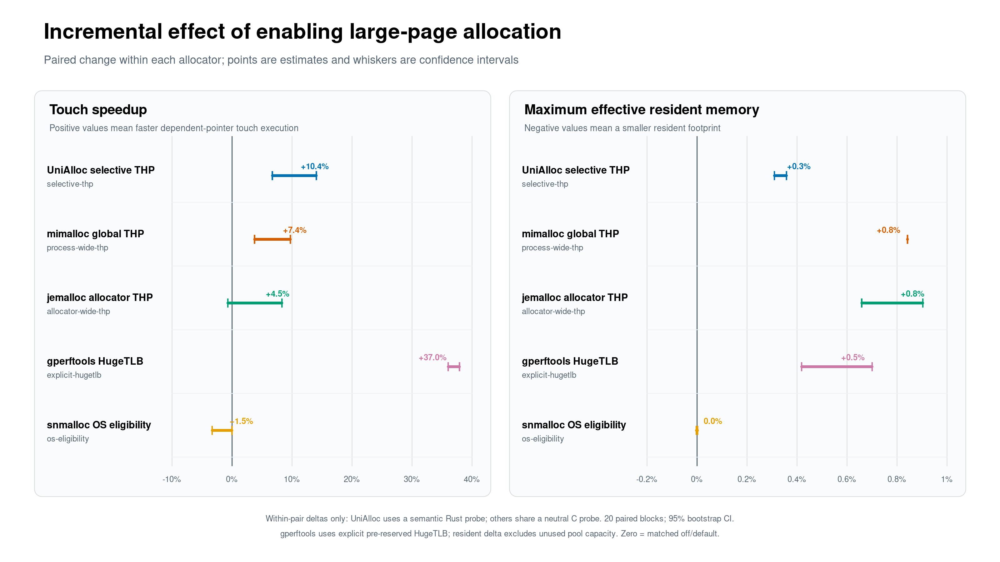
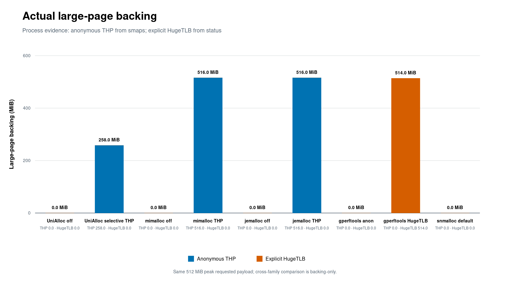
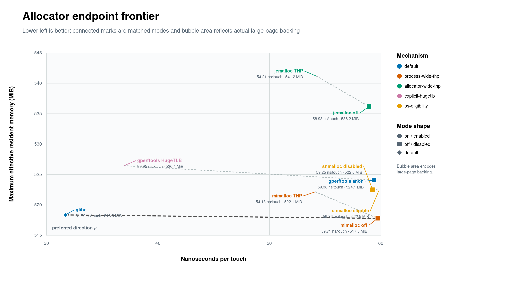

# Cross-allocator large-page evaluation：lifetime-guided THP 对比全局策略

## 结论

在本机固定 CPU/NUMA 的 512 MiB translation-stress trace 上，UniAlloc 的
**selective lifetime THP** 相对“相同 lifetime layout、相同 trace、进程 THP 强制关闭”
将 dependent-touch 延迟降低 **10.37%**，paired bootstrap 95% CI 为
**[+6.72%, +14.05%]**；最大有效驻留内存增加 **0.334%**
`[+0.309%, +0.358%]`。这个 pair 只改变物理 THP eligibility，直接支持
“lifetime hint 指导哪些 cohort 获得 THP backing”这一机制 claim。

同一批数据中，mimalloc 的进程级 THP point estimate 为 **+7.42%**，jemalloc 为
**+4.51%**且区间跨过零。这些数值是各 allocator 自身 on/off pair 的增量
effect：UniAlloc 来自 semantic Rust probe，mimalloc/jemalloc 来自 allocator-neutral C
probe。UniAlloc 只形成 **258 MiB** actual THP backing；mimalloc 与 jemalloc 的全局
策略均形成 **516 MiB** backing。50% long-lived trace 上，lifetime selection 将 THP
footprint 减半，并在自身 semantic pair 中产生 10.37% matched speedup。跨 family
比较的有效解释范围限定为并列增量效应与 backing cost。

gperftools TCMalloc 的显式 HugeTLB pair 达到 **+37.00%**，同时使用 **514 MiB**
预留 HugeTLB backing。它代表 deterministic、whole-heap、显式 pool 机制；UniAlloc
代表 anonymous-memory、selective、transparent promotion 机制。两者适合在 slide 中
并列展示为不同部署成本下的设计点。

## Slide-ready 主图

### 1. 打开 large-page 路径后的 matched effect

- 可编辑版本：[`incremental-effect.svg`](figures/cross-allocator-large-page-20260714/incremental-effect.svg)
- 图表数据：[`incremental-effect.csv`](figures/cross-allocator-large-page-20260714/incremental-effect.csv)
- 推荐标题：**Lifetime-guided THP delivers a 10.4% matched speedup with 0.3% peak-memory cost**
- 推荐脚注：*Within-pair deltas only: UniAlloc uses a semantic Rust probe; others
  share one neutral C probe. 20 paired blocks; 95% paired-bootstrap CI.
  gperftools uses pre-reserved HugeTLB; resident delta excludes unused pool capacity.*

### 2. 实际 large-page backing

- 可编辑版本：[`actual-backing.svg`](figures/cross-allocator-large-page-20260714/actual-backing.svg)
- 图表数据：[`actual-backing.csv`](figures/cross-allocator-large-page-20260714/actual-backing.csv)
- 推荐标题：**Lifetime selection halves THP backing: 258 MiB versus 516 MiB global THP**
- 推荐脚注：*Same 512 MiB peak requested payload; cross-family comparison is
  backing-only. Backing comes from per-process `AnonHugePages` or `HugetlbPages`.*

### 3. allocator-neutral endpoint（appendix）

- 可编辑版本：[`endpoint-frontier.svg`](figures/cross-allocator-large-page-20260714/endpoint-frontier.svg)
- 图表数据：[`endpoint-frontier.csv`](figures/cross-allocator-large-page-20260714/endpoint-frontier.csv)
- 该图只包含 allocator-neutral family，支持同一 C workload 下的 endpoint 比较。
- UniAlloc 使用 semantic Rust workload，其 raw endpoint 保留在独立表中；主图使用各自
  matched on/off delta 对齐两个 family。

## 核心结果

### Matched large-page effect

正数 speedup 表示 target 更快。最大有效驻留内存变化为正数时表示 target 使用更多
resident memory。每个区间来自 20 个 paired blocks 与 20,000 次 bootstrap resamples。

| Pair | Large-page mechanism | Touch speedup（95% CI） | Max resident change（95% CI） | Actual backing | 判定 |
|---|---|---:|---:|---:|---|
| UniAlloc lifetime THP on vs same layout forced off | selective anonymous THP | **+10.37%** `[+6.72%, +14.05%]` | +0.334% `[+0.309%, +0.358%]` | 258 MiB THP | improved |
| mimalloc THP on vs off | process-wide anonymous THP | **+7.42%** `[+3.75%, +9.73%]` | +0.842% `[+0.842%, +0.842%]` | 516 MiB THP | improved |
| jemalloc `thp:always` vs `thp:never` | allocator-wide anonymous THP | +4.51% `[-0.70%, +8.32%]` | +0.789% `[+0.659%, +0.903%]` | 516 MiB THP | inconclusive |
| gperftools HugeTLB vs anonymous default | explicit HugeTLB memfs | **+37.00%** `[+36.02%, +37.91%]` | +0.550% `[+0.418%, +0.701%]` | 514 MiB HugeTLB | improved |
| snmalloc default eligibility vs process THP disabled | OS-eligibility sensitivity | -1.53% `[-3.31%, -0.01%]` | approximately 0% `[-0.003%, +0.002%]` | 0 MiB in both | regressed |

snmalloc 的公开接口由 Linux PAL 决定 page eligibility。该行测量 Linux 进程
eligibility 敏感性；两种模式均观察到 0 MiB `AnonHugePages`，对应 zero-backing
OS sensitivity control。

### UniAlloc semantic family

| Case | Median touch | Median allocate/fault/free lifecycle | Max effective resident | Actual THP | Injected-noise classification failure | Policy-intent placement failure |
|---|---:|---:|---:|---:|---:|---:|
| default | 57.509 ns/touch | 1553.2 ns/allocation | 522.9 MiB | 0 MiB | 4.993% | 33.333% |
| ordinary arenas | 52.921 ns/touch | 1904.1 ns/allocation | 521.6 MiB | 0 MiB | 4.993% | 33.333% |
| lifetime layout / THP forced off | 53.262 ns/touch | 1907.4 ns/allocation | 521.5 MiB | 0 MiB | 4.993% | 4.993% |
| selective lifetime THP | **48.965 ns/touch** | **1298.9 ns/allocation** | 523.3 MiB | **258 MiB** | 4.993% | 4.993% |

`lifetime THP on` 与 `lifetime THP forced off` 是 primary causal pair：两者使用同一
`long-thp` policy、metadata、layout、prediction trace 与 probe。forced-off arm 通过
`PR_SET_THP_DISABLE=1` 禁止进程获得 THP，并以 `PR_GET_THP_DISABLE=1` 和
`AnonHugePages=0` 闭合；on arm 要求 actual THP backing 通过 gate。default 与
ordinary arms 提供部署 endpoint 和 arena-layout controls；它们的
policy-intent placement metric 记录其自身 placement semantics；classifier failure
在四个 arms 中均保持 4.993%。
表内的 4.993% 来自显式 5% false-long/false-short noise injection，用于锁定四个 arms
的 classification input；held-out compiler accuracy 属于后续真实应用评估。

### UniAlloc 内部消融：layout 与 THP 各自带来什么

下表继续使用同一批 20 个 paired blocks 与 20,000 次 bootstrap。正数表示
target 在 lower-is-better metric 上更优，负数表示相对成本。

| Target 对照 | Touch speedup | Allocate/fault/free lifecycle speedup | Steady resident reduction | Max resident reduction |
|---|---:|---:|---:|---:|
| selective THP vs same lifetime layout / THP off | **+10.37%** `[+6.72%, +14.05%]` | **+31.99%** `[+31.78%, +32.18%]` | -0.283% `[-0.327%, -0.233%]` | -0.334% `[-0.357%, -0.310%]` |
| selective THP vs ordinary arenas | **+8.55%** `[+4.28%, +12.90%]` | **+31.87%** `[+31.64%, +32.10%]` | -0.281% `[-0.326%, -0.230%]` | -0.332% `[-0.356%, -0.308%]` |
| selective THP vs default | **+16.90%** `[+13.50%, +20.38%]` | **+16.55%** `[+15.98%, +17.09%]` | **+8.09%** `[+7.61%, +8.59%]` | -0.072% `[-0.092%, -0.049%]` |
| same lifetime layout / THP off vs default | **+7.28%** `[+5.65%, +8.80%]` | -22.70% `[-23.36%, -22.06%]` | **+8.35%** `[+7.84%, +8.85%]` | +0.261% `[+0.251%, +0.272%]` |

这个 decomposition 把贡献分成两层：lifetime-directed layout 相对 default 将
steady resident 降低 8.35%，同时使 allocate/fault/free lifecycle 变慢 22.70%；selective THP
相对同 layout off arm 将该 lifecycle 加速 31.99%，最终相对 default 同时实现
16.55% allocate/fault/free lifecycle speedup 与 8.09% steady-resident reduction。该指标包含
allocation path 中每个对象的 first-byte fault，以及 free/wave/teardown 时间。整个过程的 max resident 与
default 相差 0.072%。完整消融数据保存在
[`unialloc-ablation-effects.csv`](evidence/cross-allocator-large-page-final-20260714/unialloc-ablation-effects.csv)。

### Allocator-neutral family

| Case | Median touch | Max effective resident | THP coverage / HugeTLB backing |
|---|---:|---:|---:|
| glibc default | **31.701 ns/touch** | 518.3 MiB | 0 |
| mimalloc off | 59.714 ns/touch | 517.8 MiB | 0 |
| mimalloc THP | 54.126 ns/touch | 522.1 MiB | 516 MiB；99.99% coverage |
| jemalloc off | 58.935 ns/touch | 536.2 MiB | 0 |
| jemalloc THP | 54.210 ns/touch | 541.2 MiB | 516 MiB；97.18% coverage |
| gperftools anonymous | 59.381 ns/touch | 524.1 MiB | 0 |
| gperftools HugeTLB | 36.950 ns/touch | 526.4 MiB | 514 MiB HugeTLB |
| snmalloc eligible | 59.859 ns/touch | 522.5 MiB | 0 |
| snmalloc process THP disabled | 59.255 ns/touch | 522.5 MiB | 0 |

glibc default 在这个 allocator-neutral endpoint 上记录最低 touch time。matched pair
回答 large-page control 的增量效果，endpoint 表回答该固定 malloc/free workload 的
整体结果。两种视角共同防止把 page-size 机制效果等同于通用 allocator 排名。

## 两个 family 的证据边界

### UniAlloc semantic causal family

Rust probe 携带 `(callsite, type_id, module_id, lifetime, confidence)`，并让 prediction
控制 long/short cohort 的物理 placement。primary pair 保持 semantic trace 与
lifetime-directed layout 完全一致，只切换 THP eligibility。这一 family 回答：
**已经拥有 Rust lifetime hint 时，selective THP backing 能否带来额外收益。**

### Allocator-neutral family

单一 C malloc/free binary 为每个 allocator 运行相同 seed、checksum、对象顺序、
pointer-chase 与 wave。各 allocator 的 on/off arm 只使用其可公开配置的对应机制。
这一 family 回答：**现有通用 allocator 的 large-page control 在相同中立 trace 上有多大
matched effect。**

跨 family 的 absolute `ns/touch` 受到 Rust semantic arena 与 C malloc ABI path 的共同
影响。本文只跨 family 比较 matched percentage effect、实际 backing footprint 与部署
机制；raw endpoint 排名保持 family 内部闭合。
两个 probe family 的 wave 语义也各自保持：Rust `ephemeral_waves=2` 表示初始
cohort 加一个 extra cohort，C `waves=2` 表示初始 cohort 加两个 extra cohorts。
这一差异进一步将跨 family 解释范围限定为增量 effect 和 backing trade-off。

## Allocator controls 与 actual-backing contract

Linux 将 `MADV_HUGEPAGE` 定义为 eligibility hint，并由内核决定 anonymous THP
backing；`PR_SET_THP_DISABLE` 提供进程级禁用控制。语义与限制见
[Linux Transparent Hugepage documentation](https://docs.kernel.org/admin-guide/mm/transhuge.html)。
本实验以 `/proc/self/smaps_rollup` 的 `AnonHugePages` 证明 actual THP，以
`/proc/self/status` 的 `HugetlbPages` 证明 actual HugeTLB，以
`VmRSS + HugetlbPages` 计算 effective resident。

| Allocator / case | Formal control | 固定项 | 官方依据 |
|---|---|---|---|
| UniAlloc | selected VMA `MADV_HUGEPAGE`; off arm `PR_SET_THP_DISABLE=1` | 相同 lifetime layout 与 trace | [Linux THP](https://docs.kernel.org/admin-guide/mm/transhuge.html) |
| mimalloc 3.3.2 | `MIMALLOC_ALLOW_THP=1/0` | large OS pages 与 reserved huge pages 关闭；purge threshold 固定 | [v3.3.2 README](https://github.com/microsoft/mimalloc/blob/v3.3.2/readme.md), [options API](https://microsoft.github.io/mimalloc/group__options.html) |
| jemalloc 5.3.x | `thp:always` / `thp:never` | `metadata_thp:disabled` | [jemalloc `opt.thp`](https://jemalloc.net/jemalloc.3.html#opt.thp) |
| gperftools TCMalloc 2.18.1 | `TCMALLOC_MEMFS_MALLOC_PATH` | `TCMALLOC_MEMFS_DISABLE_FALLBACK=1` in HugeTLB arm | [TCMalloc docs](https://gperftools.github.io/gperftools/tcmalloc.html), [memfs allocator source](https://github.com/gperftools/gperftools/blob/gperftools-2.18.1/src/memfs_malloc.cc) |
| snmalloc 0.2.27 | Linux process eligibility on/off | 相同 snmalloc shared shim | [Linux PAL](https://github.com/microsoft/snmalloc/blob/main/src/snmalloc/pal/pal_linux.h) |

本轮的 “TCMalloc” 特指 **gperftools TCMalloc 2.18.1**。Google TCMalloc 的
HugePage-aware allocator（Temeraire/HPAA）属于另一实现与配置体系，参考
[Google TCMalloc design](https://google.github.io/tcmalloc/design.html)、
[Temeraire](https://google.github.io/tcmalloc/temeraire.html) 与
[tuning guide](https://google.github.io/tcmalloc/tuning.html)。Google TCMalloc HPAA
comparison 保留为 follow-up scope。

## 实验方法

| 项目 | 正式配置 |
|---|---|
| Host | AMD EPYC 9354；2 sockets；128 logical CPUs |
| Kernel | Linux 6.8.0-111-generic x86_64 |
| THP host mode | `always [madvise] never`; defrag `madvise`; PMD 2 MiB |
| HugeTLB pool | 4,096 × 2 MiB；gperftools arm strict zero fallback |
| Pinning | CPU 15；NUMA node 0 |
| Working set | 131,072 × 4 KiB = 512 MiB peak requested payload |
| Lifetime mix | 50% long / 50% short；5% false-long + 5% false-short |
| Trace | 2 ephemeral waves；2 warmup pointer passes；32 measured dependent-pointer passes |
| Sampling | 1 discarded warmup block + 20 measured randomized complete blocks |
| Uncertainty | paired geometric-mean effect；20,000 bootstrap resamples；fixed seed 20260714 |
| Backing gates | THP from `AnonHugePages`; HugeTLB from `HugetlbPages`; off arms require zero backing |

每个 measured block 包含 4 个 semantic cases 和 9 个 neutral cases。neutral cases
共享 checksum；semantic on/off 共享 metadata、trace topology 与 classification counts。
`summary.json` 标记 `invariants_passed=true` 与 `claim_grade=true`，表示该 synthetic
benchmark 的预注册 backing、pairing 与完整性 gate 全部通过。

## Classification 与 runtime validation

本轮 cross-allocator campaign 使用 static `long-thp` policy，并通过
`--false-long-rate 0.05 --false-short-rate 0.05` 注入合成 prediction noise。所有 UniAlloc
arms 的 observed median classification failure 都为 **4.993%**；该数值是接近 5% 的
synthetic robustness/control input，尚未代表 compiler 在 held-out Rust 程序上的经验准确率。
primary on/off pair 共享完全相同的 injected error，observed **+10.37%** effect 来自
physical THP eligibility，分类成功率在两个 arms 中保持一致。

runtime validation 已在独立 synthetic epoch experiment 中测量：注入的 static
placement failure **4.990%** 经 death-epoch survival validation 降到 **1.263%**，降低 **74.68%**，
并将 false-positive placement 清零。该结果、同步 collapse 成本与边界记录在
[`lifetime-thp-evaluation.md`](lifetime-thp-evaluation.md)。两个 campaign 支持串联的
研究叙事：static lifetime hint 选择 candidate cohort；runtime survival 验证修正
placement；本轮 matched pair 量化被选 cohort 获得 actual THP 后的性能增量。

## Presentation script

### Slide 1 — Causal effect

> We compare each allocator with its own large-page path disabled. UniAlloc keeps
> the lifetime layout and trace identical and changes only process THP eligibility.
> Selective lifetime THP improves dependent-touch latency by 10.4%, with a 95%
> interval of 6.7% to 14.1%, at a 0.33% maximum-resident-memory cost.

口头补充：mimalloc 的 global THP 为 7.4%；jemalloc 的区间跨零；gperftools explicit
HugeTLB 为 37.0%，对应另一套显式 pool 部署机制。

### Slide 2 — Selectivity

> The lifetime hint changes where large pages are spent. UniAlloc backs only the
> selected long-lived cohort: 258 MiB of THP, versus 516 MiB under global THP in
> mimalloc and jemalloc. On this 50/50 trace, semantic selection halves large-page
> backing while the semantic on/off pair records a 10.4% matched speedup.

口头补充：off arms 均以 per-process procfs 读数验证 0 MiB backing；数字表达实际物理
backing，而非 `madvise` 返回成功。

### Slide 3 — Research contribution and boundary

> The contribution is a compiler/runtime-to-allocator contract: static Rust
> lifetime identity selects candidate VMAs, runtime survival can validate the
> prediction, and the allocator spends THP only on accepted cohorts. The current
> evidence isolates all three links: a shared injected 5% prediction-noise
> control (4.993% observed), a separate synthetic runtime reduction to 1.263%,
> and a 10.4% matched THP speedup. Held-out compiler accuracy remains future work.

口头补充：当前数据来自单机 synthetic translation-stress trace。下一层证据目标是
真实 Rust service 的 held-out classification、tail latency、长期碎片与 THP split。

## 可陈述 claim 与边界

### 当前数据直接支持

- 在该 host 与 trace 上，lifetime-guided selective THP 相对 exact same-policy off
  control 提供 **10.37%** dependent-touch speedup，95% CI 全部高于零。
- selective policy 使用 **258 MiB** THP；mimalloc process THP 与 jemalloc allocator THP 均使用
  **516 MiB**。该 50/50 trace 的 THP backing footprint 降低 50%。
- UniAlloc、mimalloc 与 jemalloc 的 transparent-THP matched point estimates分别为
  10.37%、7.42% 与 4.51%；它们分别量化各自 family 内的 on/off effect，
  jemalloc 结果保持 inconclusive 标注。
- gperftools explicit HugeTLB 提供更高的 37.00% effect，并对应显式预留 pool、
  whole-heap backing 与 strict zero-fallback contract。
- actual backing、classification error 与 timing 分别记录；physical-backing claim
  solely uses procfs measurements。

### 后续证据范围

- 真实 Rust applications：held-out lifetime classification、throughput、P99 latency、
  page-fault 与 TLB counter。
- 多 size classes、多线程、跨 NUMA、长期运行下的 fragmentation、THP split 与 reclaim。
- Google TCMalloc HPAA、THP=`always` host mode、不同 kernel 与不同 2 MiB coverage。
- perf counter 归因；本轮 headline 使用 elapsed dependent-pointer latency 与 procfs
  backing evidence。

## Evidence index

- Formal summary：[`summary.json`](evidence/cross-allocator-large-page-final-20260714/summary.json)
- Case table：[`summary.csv`](evidence/cross-allocator-large-page-final-20260714/summary.csv)
- Paired effects：[`toggle-effects.csv`](evidence/cross-allocator-large-page-final-20260714/toggle-effects.csv)
- UniAlloc internal ablations：[`unialloc-ablation-effects.csv`](evidence/cross-allocator-large-page-final-20260714/unialloc-ablation-effects.csv)
- Full parsed samples：[`samples.jsonl`](evidence/cross-allocator-large-page-final-20260714/samples.jsonl)
- Exact command and library hashes：[`runner-manifest.json`](evidence/cross-allocator-large-page-final-20260714/runner-manifest.json)
- Third-party build provenance：[`library-build-provenance.json`](evidence/cross-allocator-large-page-final-20260714/library-build-provenance.json)
- Host before / after：[`host-before.txt`](evidence/cross-allocator-large-page-final-20260714/host-before.txt), [`host-after.txt`](evidence/cross-allocator-large-page-final-20260714/host-after.txt)
- Verification record：[`verification.txt`](evidence/cross-allocator-large-page-final-20260714/verification.txt)
- Evidence hashes：[`manifest.json`](evidence/cross-allocator-large-page-final-20260714/manifest.json)
- Figure hashes：[`figures/.../manifest.json`](figures/cross-allocator-large-page-20260714/manifest.json)

Qualifier/paper 推荐使用前两张图作为主结果：**10.4% matched speedup、0.3% peak-memory
cost、50% lower THP backing**。gperftools HugeTLB 保留为 explicit upper-control，
jemalloc 保留 inconclusive interval，snmalloc 保留 zero-backing sensitivity control。
