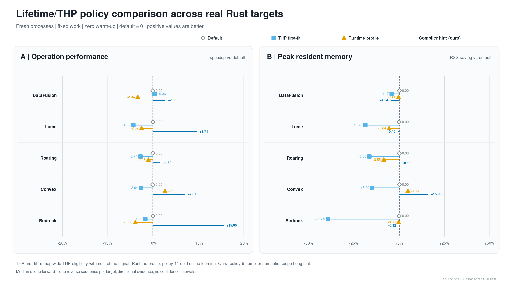

# Four-arm lifetime/THP comparison

The editable SVG and 2x PNG are rendered from `../../evidence/lifetime-four-arm-real-targets-20260716/aggregate.json` by `evaluation/scripts/render_lifetime_four_arm_real_targets.py`.

Positive values are better. Default is zero. Each point is the median of one forward and one reverse effect relative to the same-order default; the evidence has no confidence interval.
