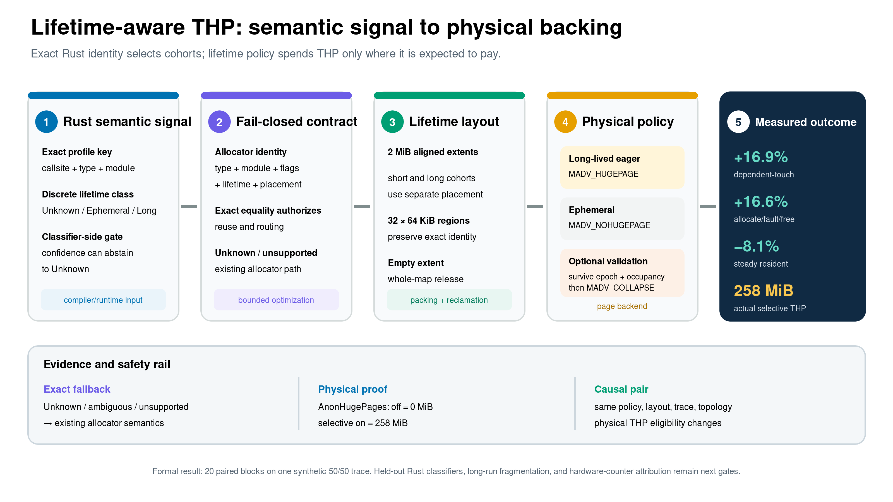
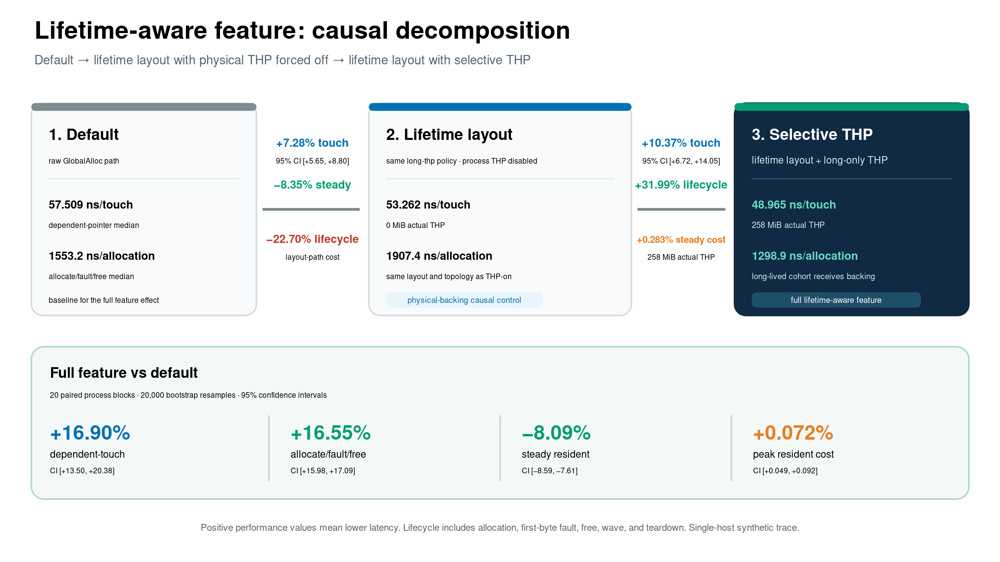

# Lifetime-aware THP allocation: design record and presentation guide

**Status: presentation-ready mechanism with a single-host synthetic evaluation.**

**Recommended path: eager, long-lived-only anonymous THP.**

**Current primary result: relative to the default allocator path, the full
feature improves dependent-touch performance by 16.90%, improves
allocate/fault/free lifecycle performance by 16.55%, and reduces steady
effective resident memory by 8.09%.**

This document is the canonical design record for lifetime-aware allocation. It
connects the following evidence into one presentation-safe narrative:

- the compiler/runtime metadata and allocator identity contract;
- lifetime-directed layout, selective THP, and runtime validation;
- the causal decomposition of the full feature toggle;
- matched controls for mimalloc, jemalloc, gperftools, and snmalloc;
- a qualifier/paper slide sequence, speaker notes, defensible claims, and claim
  boundaries.

The formal cross-allocator results come from
[`cross-allocator-large-page-evaluation.md`](cross-allocator-large-page-evaluation.md).
Raw samples, bootstrap intervals, and manifests are in
[`evidence/cross-allocator-large-page-final-20260714/`](evidence/cross-allocator-large-page-final-20260714/).

## Thesis

> **UniAlloc turns Rust lifetime identity into a physical page-placement
> contract: segregate objects by predicted lifetime, spend THP only on accepted
> long-lived cohorts, and optionally validate survival before promotion.**

A numeric version for the presentation is:

> **On this trace, lifetime-aware allocation delivers +16.9% dependent-touch
> performance, +16.6% allocate/fault/free performance, and -8.1% steady resident
> memory; in the cross-family backing comparison, semantic selection uses half
> the THP backing of global controls.**

## Exact feature-toggle definition

The experimental "lifetime-aware feature" is a runtime policy effect. Every
UniAlloc arm uses the same binary, built with `lifetime_hugepage` support. The
policy determines whether an allocation enters a lifetime arena and whether
the accepted long-lived cohort receives THP backing.

| Arm | Configuration | Role |
|---|---|---|
| Feature off | `raw-default` | Existing `GlobalAlloc` path with no lifetime-arena routing |
| Layout control | `long-thp` + `PR_SET_THP_DISABLE=1` | Preserves the on arm's metadata, layout, advice path, and topology while forcing physical THP backing to zero |
| Feature on | `long-thp` + `TransparentHugepage` | Lifetime-directed layout plus selective THP for accepted long-lived objects |
| Ordinary control | `ordinary-segregated` | Lifetime segregation with ordinary 2 MiB-aligned extents |

These arms answer three distinct questions:

1. **Feature on versus default:** What is the end-to-end effect of the complete
   lifetime-aware design?
2. **Layout control versus default:** What is the effect of lifetime-directed
   packing and routing?
3. **Feature on versus the same layout with THP forced off:** What is the causal
   effect of physical THP backing?

## Design goals and decision

### Problem

A global THP control lets the allocator's entire eligible heap compete for
2 MiB backing. Rust allocations already carry type, module, callsite,
ownership, and lifetime semantics. UniAlloc turns these semantics into a
physical-placement control plane:

- short-lived objects retain ordinary backing and can be reclaimed
  independently when their extents drain;
- accepted long-lived objects co-locate in THP-eligible extents;
- ambiguous or unsupported objects use the existing allocator path;
- runtime survival can filter static false-long predictions;
- allocator advice, physical backing, timing, and residency are validated as
  separate evidence layers.

### Decision

The current deployment candidate is the eager
`LongLivedHugepage + TransparentHugepage` policy. It provides the strongest
measured performance/residency trade-off and uses anonymous memory backed by
kernel-managed transparent huge pages.

`EpochCohortHugepage` remains a research mechanism. It demonstrates that
runtime survival can improve physical-placement precision. Its current
synchronous `MADV_COLLAPSE` path has substantial lifecycle and transient-memory
costs. The next version should use an asynchronous promotion queue with explicit
memory and collapse-latency budgets.

## Compiler/runtime-to-allocator contract

### 1. Static semantic input and exact identity

`AllocationMetadata` carries:

```text
type_id, module_id, flags, lifetime_hint, placement_hint, callsite
```

Key implementation points:

- lifetime vocabulary and exact `Unknown/Ephemeral/LongLived` mapping:
  `unialloc/src/alloc_api/type_isolation.rs:294-323`;
- metadata ABI: `unialloc/src/alloc_api/type_isolation.rs:344-425`;
- exact identity equality: `unialloc/src/alloc_api/type_isolation.rs:6012-6021`;
- allocator identity key: `unialloc/src/alloc_api/type_isolation.rs:6023-6043`;
- arena identity: `unialloc/src/alloc_api/lifetime_hugepage.rs:378-409`.

The compiler/profile lookup uses exact `(callsite, type_id, module_id)` keys.
The allocator reuse identity uses exact
`(type_id, module_id, flags, lifetime_hint, placement_hint)`. The callsite is
retained as provenance and coverage evidence because an allocation site and its
matching Drop site can differ. A hash locates a candidate bucket; complete
field equality authorizes reuse.

### 2. Confidence, abstention, and profile selection

The compiler-side profile represents lifetime class and confidence, applies the
configured threshold, and emits the discrete class consumed by the allocator:

- profile class, confidence, and thresholding:
  `tools/unialloc-rustc-pass/unialloc-rustc-mir-rewrite-dry-run.rs:597-730`;
- duplicate-key ambiguity handling:
  `tools/unialloc-rustc-pass/unialloc-rustc-mir-rewrite-dry-run.rs:632-647`;
- fail-closed profile selection:
  `tools/unialloc-rustc-pass/unialloc-rustc-mir-rewrite-dry-run.rs:739-814`.

The allocator ABI receives the thresholded `lifetime_hint`; continuous
confidence stays compiler-side and outside `AllocationMetadata` and allocator
reuse identity.
Low-confidence, missing, stale, duplicate, malformed, or explicitly unknown
predictions produce `lifetime_hint=Unknown`.

The cross-allocator campaign fixes the threshold at 0 and classification
coverage at 100%, then injects 5% false-long and 5% false-short labels. This
locks every arm to the same controlled prediction trace. The independent
confidence experiment evaluates abstention and runtime validation. Held-out
calibration on real Rust applications is a separate future evidence gate.

### 3. MIR semantic continuity

The compiler writes the selected metadata directly into allocator-facing MIR:

- direct allocator MIR injection:
  `tools/unialloc-rustc-pass/unialloc-rustc-mir-rewrite-dry-run.rs:9146-9168,9290-9359`;
- exact-owner semantic-scope propagation:
  `tools/unialloc-rustc-pass/unialloc-rustc-mir-rewrite-dry-run.rs:10288-10520`;
- conservative Drop ambiguity recovery:
  `tools/unialloc-rustc-pass/unialloc-rustc-mir-rewrite-dry-run.rs:10787-10953`.

The production `GlobalAlloc` path consumes this metadata at
`unialloc/src/cache/mod.rs:926-1017`. Runtime selection preserves the existing
fallback order at `unialloc/src/alloc_api/type_isolation.rs:12513-12602`.
Address provenance carries the correct release backend across semantic-scope
exit and foreign-thread release; free and realloc handling are at
`unialloc/src/cache/mod.rs:622-648,697-726`.

### 4. Compiler-to-allocator mechanism gate

The separate production integration gate closes the semantic continuity chain
with the real allocator. A synthetic single-`Vec` binary collects exact
`Vec::with_capacity`, `Vec::shrink_to_fit`, and implicit Drop identities,
constructs a profile, applies the MIR rewrite, and runs UniAlloc as the global
allocator. It hard-gates:

- 3 exact profile matches and 0 misses;
- 3 applied rewrites;
- 1 real HugeTLB mapping and 0 fallback;
- a matching routed release and 1 `munmap`;
- restoration of the persistent HugeTLB pool.

This is an end-to-end synthetic **mechanism-continuity** result. Its claim scope
is mechanism continuity; classifier quality and application performance remain
open. The design, command, and evidence boundary are documented in
[`lifetime-hugepage-production-evaluation.md`](lifetime-hugepage-production-evaluation.md#compiler-to-hugetlb-integration-gate).

### 5. Fail-closed runtime fallback

`LifetimeHugepagePolicy::requested_backing` returns `None` for `Unknown`, and
unsupported layouts continue through the existing allocator path. A policy
change is accepted only when there are zero live objects and zero live extents:

- policy/backing decision:
  `unialloc/src/alloc_api/lifetime_hugepage.rs:94-125`;
- safe configuration:
  `unialloc/src/alloc_api/lifetime_hugepage.rs:1641-1668`;
- allocation fallback:
  `unialloc/src/alloc_api/lifetime_hugepage.rs:1723-1750`.

This boundary makes compiler coverage determine only optimization coverage.
Ambiguous allocations retain the existing allocator semantics.

## Allocator architecture

### Policy and page backend are orthogonal

`LifetimeHugepagePolicy` selects cohort placement;
`LifetimePageBackend` selects physical backing:

| Policy | Ephemeral | Long-lived | Unknown |
|---|---|---|---|
| `Disabled` | Existing allocator | Existing allocator | Existing allocator |
| `SegregatedOrdinary` | Ordinary arena | Separate ordinary arena | Existing allocator |
| `LongLivedHugepage` | Ordinary arena | Large-page arena | Existing allocator |
| `SegregatedHugepage` | Large-page arena | Separate large-page arena | Existing allocator |
| `EpochCohortHugepage` | Ordinary arena | Survival candidate | Existing allocator |

The backend is `ExplicitHugeTLB` or `TransparentHugepage`. The interfaces and
policy mapping are in `unialloc/src/alloc_api/lifetime_hugepage.rs:48-125`.

### Two-level placement

The allocator uses two geometry levels:

1. A **2 MiB extent** groups objects by lifetime, size class, alignment class,
   and optional epoch cohort.
2. A **64 KiB identity region** serves exactly one live allocator identity,
   allowing multiple Rust identities to co-pack in one coarse extent.

The constants and geometry checks are at
`unialloc/src/alloc_api/lifetime_hugepage.rs:26-46,1480-1510`. One 2 MiB extent
contains 32 identity regions. A region can accept a new identity after its last
slot is released; an extent is immediately `munmap`-ed when its live count
reaches zero. Release, provenance, and whole-extent reclamation are implemented
at `unialloc/src/alloc_api/lifetime_hugepage.rs:1365-1435`.

### Eager selective THP

The `LongLivedHugepage + TransparentHugepage` path is:

```text
LongLived -> 2 MiB-aligned anonymous mapping -> MADV_HUGEPAGE
Ephemeral -> ordinary aligned mapping -> MADV_NOHUGEPAGE
Unknown or unsupported -> existing allocator
```

The THP mapping path is at
`unialloc/src/alloc_api/lifetime_hugepage.rs:1585-1611`.
`MADV_HUGEPAGE` establishes eligibility. The formal backing claim uses the
per-process `/proc/self/smaps_rollup:AnonHugePages` measurement.

### Runtime survival validation

`EpochCohortHugepage` initially retains an accepted-long extent as a
`MADV_NOHUGEPAGE` candidate:

```text
static accepted-long candidate
  -> survives an explicit epoch boundary
  -> live occupancy >= 50%
  -> MADV_HUGEPAGE + MADV_COLLAPSE
  -> point-in-time confirmed physical promotion
```

The 50% occupancy threshold is a feasibility-study parameter. The candidate,
eligibility, and promotion conditions are implemented at
`unialloc/src/alloc_api/lifetime_hugepage.rs:517-536,1093-1159,1305-1350`.
`lifetime_hugepage_advance_epoch()` detaches the cohort and performs synchronous
promotion at `unialloc/src/alloc_api/lifetime_hugepage.rs:1674-1695`.

A short object released before the boundary remains in ordinary placement even
when it received a false-long prediction. Sparse survivors increment the
low-occupancy skip metric. This mechanism measures prediction quality and
physical-placement quality independently.



- Editable source:
  [`lifetime-aware-thp-pipeline.svg`](figures/lifetime-aware-thp-design-20260714/lifetime-aware-thp-pipeline.svg)

## Evidence contract

### Physical backing

| Evidence | Scope of interpretation |
|---|---|
| Successful `madvise` return | The VMA accepted the advice |
| `AnonHugePages` | Anonymous THP backing owned by the process |
| `HugetlbPages` | Explicit HugeTLB backing owned by the process |
| `VmRSS + HugetlbPages` | Effective process residency |
| Successful `MADV_COLLAPSE` | Point-in-time collapse; procfs closes the steady-backing claim |

### Lifecycle metric

`allocate_one()` writes the first byte immediately after allocation. The formal
lifecycle metric is therefore the **allocate/fault/free lifecycle**. It includes
allocation, ephemeral release, wave execution, teardown, and the first epoch
advance. Separately recorded evidence-sampling time is excluded.

Probe paths:

- allocation and first-byte fault:
  `unialloc/examples/lifetime_hugepage_allocator_probe.rs:795-815`;
- policy/backend setup:
  `unialloc/examples/lifetime_hugepage_allocator_probe.rs:1013-1030`;
- phases, memory sampling, and pointer chase:
  `unialloc/examples/lifetime_hugepage_allocator_probe.rs:1128-1254`.

### Primary causal pair

The `feature on` and `same layout forced off` arms preserve:

- the `long-thp` policy;
- metadata and the injected prediction trace;
- allocation/deallocation topology;
- extent/region assignments;
- seed, object count, size, wave, and pointer chase.

The off arm additionally sets `PR_SET_THP_DISABLE=1`, then gates on
`PR_GET_THP_DISABLE=1` and `AnonHugePages=0`. The on arm requires actual THP
backing. The evaluator contract is at
`evaluation/scripts/cross_allocator_large_page_experiment.py:77-107,390-436,580-680`.

## Causal decomposition of the full feature



- Editable source:
  [`lifetime-aware-feature-decomposition.svg`](figures/lifetime-aware-thp-design-20260714/lifetime-aware-feature-decomposition.svg)
- Figure data:
  [`lifetime-aware-feature-decomposition.csv`](figures/lifetime-aware-thp-design-20260714/lifetime-aware-feature-decomposition.csv)

The campaign uses 20 paired process blocks and 20,000 fixed-seed bootstrap
resamples:

| Comparison | Dependent touch | Allocate/fault/free lifecycle | Steady resident | Peak resident |
|---|---:|---:|---:|---:|
| Lifetime layout / physical THP off vs default | **+7.28%** `[+5.65%, +8.80%]` | **-22.70%** `[-23.36%, -22.06%]` | **-8.35%** `[-8.85%, -7.84%]` | -0.261% |
| Selective THP vs same layout off | **+10.37%** `[+6.72%, +14.05%]` | **+31.99%** `[+31.78%, +32.18%]` | +0.283% cost | +0.334% cost |
| **Full feature vs default** | **+16.90%** `[+13.50%, +20.38%]` | **+16.55%** `[+15.98%, +17.09%]` | **-8.09%** `[-8.59%, -7.61%]` | +0.072% cost |

Interpretation:

- lifetime-directed layout provides most of the steady-residency reduction;
- the layout path alone incurs allocator lifecycle cost;
- selective THP recovers lifecycle performance and further reduces
  dependent-touch latency;
- the two stages compose as ratios to produce the full feature's 16.90% touch
  improvement;
- peak and steady resident values are process-residency metrics; long-run
  fragmentation requires separate evidence.

## Position relative to general-purpose allocator controls

| Within-pair control | Touch effect (95% CI) | Actual backing | Peak-resident cost |
|---|---:|---:|---:|
| **UniAlloc selective THP** | **+10.37%** `[+6.72%, +14.05%]` | **258 MiB THP** | +0.334% |
| mimalloc global THP | +7.42% `[+3.75%, +9.73%]` | 516 MiB THP | +0.842% |
| jemalloc allocator THP | +4.51% `[-0.70%, +8.32%]` | 516 MiB THP | +0.789%; inconclusive |
| gperftools explicit HugeTLB | +37.00% `[+36.02%, +37.91%]` | 514 MiB HugeTLB | +0.550% |
| snmalloc OS eligibility | -1.53% `[-3.31%, -0.01%]` | 0 MiB | Approximately equal |

A presentation-safe statement is:

> On the 50/50 trace, semantic selection halves actual THP backing relative to
> global mimalloc/jemalloc THP while UniAlloc's own causal pair records a 10.4%
> speedup.

The cross-family comparison is limited to each allocator's within-pair delta,
actual backing, and deployment mechanism. UniAlloc uses the semantic Rust probe;
third-party allocators share a neutral C probe. gperftools uses pre-reserved
explicit HugeTLB, and its resident delta excludes idle pool capacity.

Recommended primary figures:

- [`incremental-effect.png`](figures/cross-allocator-large-page-20260714/incremental-effect.png)
- [`actual-backing.png`](figures/cross-allocator-large-page-20260714/actual-backing.png)
- allocator-neutral appendix:
  [`endpoint-frontier.png`](figures/cross-allocator-large-page-20260714/endpoint-frontier.png)

## Classification and runtime validation

### Current cross-allocator campaign

- Explicitly injected synthetic noise: 5% false-long plus 5% false-short.
- Observed classification failure: **4.993%**.
- Observed success: **95.007%**.
- Coverage: **100%**.
- All four UniAlloc arms use the exact same prediction trace.

These measurements establish the controlled robustness input and causal pairing.
Held-out compiler-classifier accuracy remains unevaluated.

### Independent synthetic epoch campaign

- Static-placement failure: **4.990%**.
- Runtime-confirmed placement failure: **1.263%**.
- Failure reduction: **74.68%**.
- False-positive physical placement: **0**.

The current synchronous epoch implementation adds 57.79% lifecycle cost and
41.50% maximum resident memory on this separate trace. The result supports the
survival-validation mechanism and motivates asynchronous promotion, cohort
reuse, and explicit budget control. Full evidence is in
[`lifetime-thp-evaluation.md`](lifetime-thp-evaluation.md).

## Prior-work boundary

Lifetime-aware large-page placement has strong foundations:

- [LLAMA, ASPLOS 2020](https://colinraffel.com/publications/asplos2020learning.pdf):
  allocation-context lifetime prediction, multiple lifetime classes, 2 MiB
  placement, and dynamic error recovery;
- [TEMERAIRE, OSDI 2021](https://www.usenix.org/system/files/osdi21-hunter.pdf):
  fullness-aware hugepage packing, tail donation, and subrelease;
- [Warehouse-scale TCMalloc, ASPLOS 2024](https://people.csail.mit.edu/delimitrou/papers/2024.asplos.memory.pdf):
  allocator-derived short/long span separation and fleet-scale validation.

UniAlloc's defensible contribution is the following combination:

1. exact Rust compiler/profile identity binding;
2. metadata continuity across allocation, ownership transfer, realloc, Drop,
   and foreign-thread release;
3. a fail-closed `Unknown -> existing allocator` contract;
4. lifetime-directed layout with selective anonymous THP;
5. runtime survival and occupancy as inputs to physical promotion;
6. separate evidence for advice, actual backing, classification, placement,
   timing, and residency.

## Recommended four-slide story

### Slide 1: Lifetime hints decide where large pages are spent

**On-slide text**

- Global THP controls: 516 MiB actual THP on the 512 MiB trace.
- UniAlloc: 258 MiB selective THP.
- Question: Can Rust lifetime semantics improve speed and steady residency while
  spending fewer large pages?

**Visual**

Use `lifetime-aware-thp-pipeline.png`.

**Speaker note**

> Large pages are a placement resource. Rust already exposes semantic identity
> and lifetime information. UniAlloc uses that signal to decide where THP is
> spent, while ambiguous allocations follow the existing allocator path.

**Footer**

`Current evidence: single-host synthetic 50/50 trace; held-out classifier and long-run fragmentation remain follow-up.`

### Slide 2: Semantic contract to physical backing

**On-slide text**

```text
exact Rust identity
  -> lifetime class / confidence abstention
  -> ordinary short cohort | THP long cohort
  -> optional epoch survival + occupancy validation
  -> procfs-confirmed physical backing
```

**Speaker note**

> The contract has three layers: compiler identity selects a candidate,
> allocator routing determines the VMA, and runtime/procfs closes the loop.
> Eager long-only THP supplies the current deployment result; epoch validation
> shows that online survival can filter injected misprediction.

### Slide 3: Causal decomposition

**Headline**

> **+16.9% touch, +16.6% allocate/fault/free, -8.1% steady resident.**

**Visual**

Use `lifetime-aware-feature-decomposition.png`.

**Speaker note**

> Lifetime layout supplies the residency saving and introduces lifecycle cost.
> Selective THP recovers that path and adds dependent-touch speed. The exact
> same-layout forced-off arm isolates physical THP from placement topology.

### Slide 4: Selectivity changes the large-page cost/performance point

**Visual**

Use `incremental-effect.png` and `actual-backing.png` side by side.

**Headline**

> **10.4% matched THP speedup with half the THP backing of global controls.**

**Speaker note**

> Read every effect as an allocator's own on/off delta. gperftools represents an
> explicit pre-reserved HugeTLB upper control. UniAlloc uses anonymous THP and
> spends it only on the selected long-lived cohort.

## Committee questions and answers

### What does the feature toggle include?

The full feature combines lifetime-directed arena layout and selective THP
backing. Relative to default it records `+16.90% touch / +16.55% lifecycle /
-8.09% steady resident`. The same-layout on/off pair measures the incremental
THP effect as `+10.37% touch`.

### Is 4.993% the compiler's accuracy?

The value is the observed failure under an explicit synthetic injection of 5%
false-long and 5% false-short labels; every arm shares this input. Held-out
per-site accuracy and calibration on real Rust applications remain future
experiments.

### Can the 8.09% result be presented as fragmentation reduction?

The current direct evidence supports an 8.09% reduction in steady effective
resident memory. A long-run fragmentation claim requires size-class diversity,
arena-slack, reclamation, THP-split, and workload-phase evidence.

### How do we confirm that the process received THP backing?

The formal gate uses per-process `AnonHugePages`: the selective arm records
258 MiB and the forced-off arm records 0 MiB. The off arm also confirms
`PR_GET_THP_DISABLE=1`.

### Why does gperftools reach 37%?

That arm uses 514 MiB of explicit HugeTLB, a pre-reserved pool, whole-heap
placement, and strict zero fallback. It represents an upper control under a
different provisioning contract.

### Can we say that UniAlloc beats mimalloc or jemalloc?

The presentation reports every allocator's matched on/off effect and backing
cost. Cross-family absolute endpoints and percentage-point superiority remain
outside the current claim boundary.

### Does the speedup come from TLB behavior, fault behavior, or allocator layout?

The same-layout causal pair attributes the measured effect to large-page
eligibility plus actual backing. The lifecycle metric includes allocation,
first-byte fault, free, wave, and teardown. The required hardware performance
counters were unavailable on this host, so finer TLB/fault attribution remains
a follow-up experiment.

### What is the paper contribution beyond turning on THP?

The contribution is an exact compiler/runtime-to-allocator contract: Rust
identity selects a cohort, the allocator performs cohort-specific placement,
procfs validates physical backing, and runtime survival can filter predictions
before promotion.

## Claim ledger

| Claim | Status | Evidence |
|---|---|---|
| Full lifetime-aware feature improves touch by 16.90% on this trace | Defended | 20 paired blocks; 95% CI `[13.50%,20.38%]` |
| Full feature reduces steady resident memory by 8.09% | Defended process-residency claim | 95% CI `[7.61%,8.59%]` |
| Selective THP provides an additional 10.37% touch improvement | Defended causal claim | Same-policy/layout forced-off pair |
| Selective policy uses 258 MiB of THP | Defended backing claim | Per-process `AnonHugePages` |
| Global mimalloc/jemalloc controls use 516 MiB of THP | Defended backing claim | Neutral-family procfs evidence |
| Exact compiler profile reaches allocator mapping and release | Defended synthetic mechanism claim | 3 exact matches, 0 misses, 1 real HugeTLB mapping, and 1 matching unmap |
| Runtime survival reduces placement failure by 74.68% | Defended synthetic mechanism claim | Independent epoch campaign |
| Held-out compiler accuracy on real Rust applications | Future evidence | Training/validation split plus per-site calibration |
| Long-run allocator fragmentation reduction | Future evidence | Long-running slack/split/reclamation study |
| UniAlloc outperforms every allocator on general workloads | Future evidence | Same-binary application matrix |

## Evidence and reproduction index

### Formal cross-allocator campaign

- narrative:
  [`cross-allocator-large-page-evaluation.md`](cross-allocator-large-page-evaluation.md)
- summary:
  [`summary.json`](evidence/cross-allocator-large-page-final-20260714/summary.json)
- complete parsed samples:
  [`samples.jsonl`](evidence/cross-allocator-large-page-final-20260714/samples.jsonl)
- feature ablation:
  [`unialloc-ablation-effects.csv`](evidence/cross-allocator-large-page-final-20260714/unialloc-ablation-effects.csv)
- commands and provenance:
  [`runner-manifest.json`](evidence/cross-allocator-large-page-final-20260714/runner-manifest.json)
- verification:
  [`verification.txt`](evidence/cross-allocator-large-page-final-20260714/verification.txt)

### Runtime-validation campaign

- design and results: [`lifetime-thp-evaluation.md`](lifetime-thp-evaluation.md)
- evidence:
  [`evidence/lifetime-thp-final-20260714/`](evidence/lifetime-thp-final-20260714/)

### Compiler-to-allocator integration gate

- design and boundary:
  [`lifetime-hugepage-production-evaluation.md`](lifetime-hugepage-production-evaluation.md#compiler-to-hugetlb-integration-gate)
- host-gated regression:
  `tools/unialloc-rustc-pass/test_mir_lifetime_hugepage_integration.py`

## Design decision for the next iteration

1. Use eager, long-lived-only THP as the primary path for the presentation and
   current prototype.
2. Present runtime survival as a precision mechanism.
3. Move synchronous collapse into a background promotion queue.
4. Apply occupancy, memory, collapse-latency, and THP-split budgets in that
   queue.
5. Evaluate held-out Rust services, multithreading and NUMA, P99 latency,
   page-fault/TLB counters, arena slack, and long-run split/reclamation.

Closing line:

> **Use semantic lifetime to spend large pages where they pay: +16.9% end-to-end
> touch performance, -8.1% steady residency, and half the THP backing of global
> controls on this trace.**
