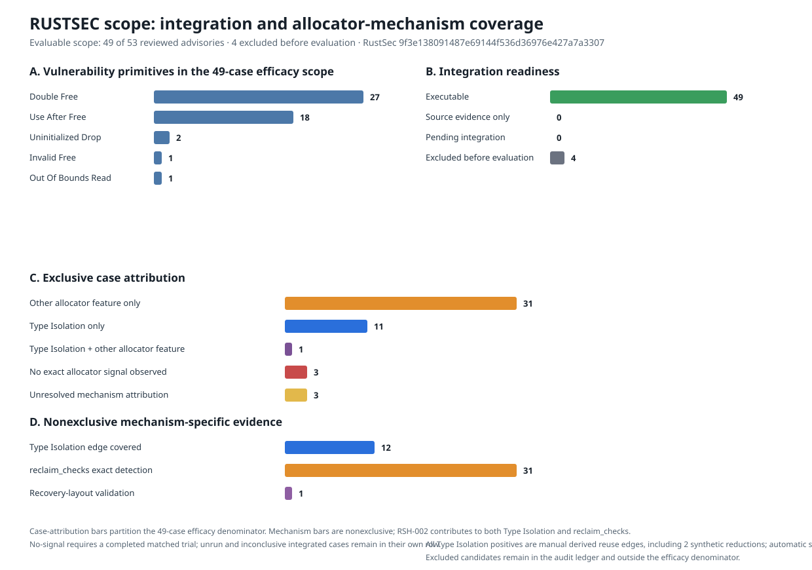

# RustSec Security-Scope Evaluation

## Reconciled terminal result

This evaluation freezes RustSec advisory-db at commit
`9f3e138091487e69144f536d36976e427a7a3307` and Rudra-PoC at commit
`6226dd030fffbed5601099cb0e24f73e4150a7f5`. The selection and execution
artifacts are exploratory (`claim_grade=false`), machine-auditable, and bounded
to the integrated witnesses.

The review identified **53 strong candidates**. The final efficacy denominator
contains the **49 candidates** with executable vulnerable oracles and controls.
Four candidates retain terminal audit reasons outside that denominator:

| Disposition | Advisories | Meaning |
|---|---:|---|
| Final evaluable efficacy scope | **49** | The repository contains a pinned runnable witness with the required controls |
| Audit-only exclusion | **4** | No root-cause-specific executable reproduction or required native dependency is available; the attempts and reason remain retained |
| Unreviewed or pending | **0** | Every reviewed candidate has an evaluable result or an evidence-backed exclusion |

The strict ledger assigns one final attribution to each of the 49 executable
advisories:

| Final case attribution | Advisories | Evidence contract |
|---|---:|---|
| Other allocator feature only | **31** | Thirty reclaim-check cases and the RSH-031 recovery-layout case have an exact policy-independent diagnostic and no Type Isolation TP |
| Type Isolation only | **11** | A manually identified cross-identity reuse edge reproduced in system and `typed_plain`, then was denied and reported by Type Isolation in 3/3 repetitions |
| Multiple allocator mechanisms | **1** | RSH-002 has distinct exact `reclaim_checks` and Type Isolation reuse-edge TPs |
| No exact allocator signal observed | **3** | RSH-049, RSH-050, and RSH-075 completed every registered matched mechanism experiment without a qualified allocator signal |
| Inconclusive or unresolved attribution | **3** | RSH-003 and RSH-019 exercise concurrency/lifetime races outside the evaluated allocator contracts; RSH-006 lacks a source-bound fingerprint |

These rows partition the final efficacy denominator:
**31 + 11 + 1 + 3 + 3 = 49**. The strict case-level positive result is
**43/49**. The generated case report records 32 `detected`, 11 `mitigated`, 3
`no_signal`, and 3 `inconclusive` cases. The four
audit-only exclusions remain visible in the reviewed-candidate funnel and never
enter an efficacy numerator or denominator. The retained figure below records
the current 49-case efficacy partition alongside the four reviewed exclusions.

The underlying mechanism ledger contains **62 result rows**: 32 `detected`, 12
`mitigated`, 12 `no_signal`, and 6 `inconclusive`. It contains **44 positive
mechanism rows across 43 unique cases**: 31 `reclaim_checks`, 1
`recovery_layout_validation`, and 12 Type Isolation rows. RSH-002 is the sole
cross-mechanism overlap. Thirteen cases retain two scenario/mechanism rows, so
row counts and case counts answer different questions. A positive row requires a repeated
vulnerable baseline, a feature-matched ablation, the mechanism-specific signal
in every treatment repetition, clean patched controls, and evidence bound to
the audited event. `true_positive=true` therefore means either an exact
duplicate-reclaim diagnostic, an exact recovery-layout diagnostic, or a causal
cross-identity reuse-edge mitigation;
the `positive_scope` field records that boundary explicitly.



Machine-readable outputs:

- `evaluation/config/rustsec_heap_complete_scope.json`
- `evaluation/config/rustsec_heap_mechanism_results.json`
- `docs/figures/rustsec-security-scope-20260714/summary.json`
- `docs/figures/rustsec-security-scope-20260714/rustsec-security-scope.csv`
- `docs/rustsec-all-53-live-evaluation.md`

## Selection funnel

| Stage | Count |
|---|---:|
| RustSec advisory records at the pinned commit | 1,140 |
| Active records | 875 |
| `memory-corruption` category | 253 |
| Active high-recall manual-review rows | 439 |
| Independent temporal/reclaim review units | 83 |
| Reviewed strong Rust-global allocator candidates | **53** |
| Final evaluable efficacy scope | **49** |
| Audit-only exclusions | **4** |
| Conditional candidates outside the strong scope | 7 |
| Evidence-backed exclusions outside the strong scope | 26 |

The 53 reviewed candidates combine 50 clear temporal/reclaim review results
with 3 additional duplicate-reclaim candidates grounded in the pinned Rudra
source. Executability and control availability reduce the efficacy denominator
to 49. This is a purposive mechanism-evaluation scope. Rust ecosystem
prevalence and population-level protection rates remain unmeasured.

## Vulnerability primitives

The chart uses the primary symptom exercised by the integrated witness. Nine
reviewed overrides preserve the evidence and reason for cases where advisory
metadata and the terminal witness symptom differ.

| Primary primitive | 53 reviewed candidates | 49-case efficacy scope |
|---|---:|---:|
| Double free | **30** | **27** |
| Use after free | **19** | **18** |
| Uninitialized drop | **2** | **2** |
| Invalid free | **1** | **1** |
| Out-of-bounds read | **1** | **1** |

The nine reviewed overrides, including the source-backed classification for the
audit-excluded `abi_stable` case, live in
`evaluation/config/rustsec_heap_primitive_overrides.json`. RSH-002 and RSH-018
remain explicit multi-primitive cases, and the ledger selects one primary chart
label while retaining their scenario-level evidence.

## Type Isolation result

Type Isolation enforces exact reuse identity: a retained object may satisfy a
request only when the compiler/runtime identity contract matches. The strict
positive evidence covers 12 exploit-enabling cross-identity reuse edges:

- RSH-002 / `RUSTSEC-2020-0007` (`bitvec`)
- RSH-008 / `RUSTSEC-2021-0130` (`lru`)
- RSH-041 / `RUSTSEC-2026-0152` (`oneringbuf`)
- RSH-042 / `RUSTSEC-2026-0128` (`emap`)
- RSH-052 / `RUSTSEC-2019-0023` (`string-interner`)
- RSH-064 / `RUSTSEC-2022-0028` (`neon`)
- RSH-055 / `RUSTSEC-2020-0145` (`heapless`)
- RSH-065 / `RUSTSEC-2023-0054` (`mail-internals`)
- RSH-066 / `RUSTSEC-2024-0007` (`rust-i18n-support`)
- RSH-067 / `RUSTSEC-2025-0004` (`openssl`)
- RSH-068 / `RUSTSEC-2025-0016` (`pared`)
- RSH-069 / `RUSTSEC-2025-0022` (`openssl`)

For every edge, system and `typed_plain` reused the vulnerable address in 3/3
repetitions. Type Isolation denied the cross-identity reuse, bound the report
to the audited replacement allocation, and avoided the address collision in
3/3 repetitions. Patched controls preserved same-identity reuse and emitted
zero denials.

All 12 claims cover manually attributed, layout-bounded reuse edges. The
source defect remains represented by its published or upstream witness, while
the derived experiment isolates the allocator decision. Automatic victim-site
coverage and full source-vulnerability detection remain at **0 demonstrated
cases**. The compiler pass now has a regression-tested monomorphized generic
`Box<T>` identity path; the 12 security positives still rely on their
explicit edge annotations.

RSH-065 is a manually modeled four-byte reserve-relocation reduction. RSH-069
is a synthetically groomed 4096-byte FFI-read reduction. These two rows preserve
the advisory root cause while carrying a stronger synthetic-reduction caveat
than the other derived edges.

All 12 strict Type Isolation matrices bind to the same frozen isolated WIP
evidence snapshot, identified by UniAlloc implementation digest
`ce653fd5c35e2d6b912b7f8111e947cce6af29a78284cd57ea45d9bc347ab9c2`.
The digest identifies that captured snapshot. The current shared-session
working tree and current HEAD have separate live provenance. The complete report exposes
`strict_typeiso_evidence_implementation_digest_counts` separately from
`replay_arm_implementation_digest_counts`.
The complete evidence bundle retains both the 12-matrix snapshot summary and a
deterministic archive plus manifest for the 136 implementation inputs that
reproduce this digest.

RSH-008 and RSH-064 retain their source-witness `inconclusive` rows beside the
derived positive rows. RSH-064's real Node/V8 witness reproduces the stale
external ArrayBuffer under both `typed_plain` and `typeiso`, with zero applied
critical rewrites. Its separate derived scenario establishes the bounded
`Vec<u8>` backing-store-to-`Replacement` reuse-edge TP. Automatic canonical
Box/Vec ownership transfer remains deferred. RSH-003 and RSH-019 exercise
same-object concurrency/lifetime races before a required cross-identity reuse
event. RSH-006 is evidence-inconclusive: its matched SIGSEGV lacks a normalized
source-bound fault/checkpoint fingerprint. Source analysis indicates a
stack-lifetime boundary, while empirical no-signal attribution remains
withheld.

## Recovery-layout validation result

RSH-031 adds one policy-independent allocator TP. The pinned upstream Miri arm
reports an allocation/deallocation layout mismatch on the vulnerable Vec Drop
edge and validates the patched source control. A derived four-arm native matrix
then emits `unialloc_recovery_deallocation_layout_mismatch` in every vulnerable
`typed_plain` and `typeiso` repetition and in zero patched repetitions. This
signal belongs to `recovery_layout_validation`; it contributes zero Type
Isolation credit.

## Optional reclaim check

The new `reclaim_checks` feature activates bounded process-wide exact-address
lifecycle tracking independently from Type Isolation. It rejects an immediate
second raw reclaim before an intervening allocator publication and reports:

```text
pointer already released
```

The original attribution campaign covers 42 matched reclaim-configuration
trials. The RSH-001 lifecycle matrix and RSH-060 partial-panic matrix raise the
final strict reclaim ledger to 44 scenario rows. Each strict comparison has six
logical arms per scenario:

```text
vulnerable, patched x system, reclaim_plain, reclaim_checks
```

Every arm requests three repetitions. The retained `system` arms establish the
vulnerability oracle and patched behavior. The original direct campaign
contributes the feature-matched `reclaim_plain` and `reclaim_checks` arms: 42
scenarios, 168 direct arms, 492 runtime executions, and 4 expected matched
compile-rejection arms. Those direct arms bind to UniAlloc implementation digest
`36bc040455f8c5fa6142a91b2321bc9d018aad08764f7d8c8e5554b3e4460847`.
The deterministic RSH-013 refresh binds all six arms to digest
`b9bd5442c557b3d39c34cf391e8c32388ba84ea643e6adc91ea4987d85adbc5a`.

Cargo metadata attestation proves the intended one-feature difference:

| Allocator arm | Resolved UniAlloc features |
|---|---|
| `reclaim_plain` | `stats` |
| `reclaim_checks` | `reclaim_checks`, `stats` |

The strict reclaim ledger contains **31 detected**, **12 no-signal**, and **1
inconclusive** scenario row. The exact allocator
diagnostic appears in all 31 vulnerable `reclaim_checks` arms and in zero
vulnerable `reclaim_plain` or patched arms. RSH-013 replaces its nondeterministic `dbg!(values)` observation
with a deterministic terminal `drop(values)`: the system arm reports ASan
double-free 3/3, `reclaim_plain` exits cleanly 3/3, `reclaim_checks` reports the
exact diagnostic 3/3, and every patched arm exits cleanly 3/3. RSH-020 uses a
fail-closed double-panic parser that accepts repeated identical source panic
checkpoints followed by Rust's standard destructor-cleanup abort; distinct
source checkpoints remain ambiguous. Its stable plain fingerprint now completes
the ablation gate. RSH-001 adds an exact duplicate-ownership/double-reclaim TP.
RSH-060 adds an advisory-derived partial-yield-then-panic TP.
The 12 reclaim no-signal rows remain mechanism-specific negative controls.
Several of those cases now have a separate Type Isolation or recovery-layout
TP. The final case-level no-signal set is RSH-049, RSH-050, and RSH-075.
RSH-006 remains evidence-inconclusive because its matched
SIGSEGV lacks a normalized source-bound fault/checkpoint fingerprint. RSH-052,
RSH-055, and RSH-065 through RSH-069 receive positive case attribution from
their separate Type Isolation scenarios; RSH-031 receives its positive case
attribution from recovery-layout validation.

The feature contract is deliberately narrow:

- exact duplicate reclaim before address reuse is covered;
- a new allocator publication starts a new address generation;
- stale access, ordinary heap-buffer overflow, uninitialized reads, and general
  UAF without a duplicate reclaim remain outside this check;
- `reclaim_checks` is opt-in; default and Type-Isolation-only builds retain
  their existing feature paths.

`detected` means the exact allocator diagnostic reproduced in every vulnerable
`reclaim_checks` repetition, remained absent from every vulnerable
`reclaim_plain` repetition, remained absent from all patched feature arms, and
was paired with a reproduced system baseline. The ledger records exact
duplicate-reclaim detection and makes no general exploit-prevention claim.

The retained feature-attribution evidence is:

- `docs/evidence/rustsec-reclaim-checks-20260714/feature-matched-campaign.json`;
- `docs/evidence/rustsec-reclaim-checks-20260714/summary-feature-matched-*.json`;
- `docs/evidence/rustsec-reclaim-checks-20260714/mechanism-results-feature-matched-*.json`;
- `docs/evidence/rustsec-reclaim-checks-20260714/mechanism-results.json`.

## Performance and RSS boundary

The optional feature was compared against `unialloc_no_optional` on two pinned
single-host workloads. Results are medians, with 7 Oxipng samples and 9
amplified ripgrep samples:

| Workload | Median wall-time delta | Median peak-RSS delta |
|---|---:|---:|
| Oxipng | -1.24% | +280 KiB (+0.63%) |
| ripgrep, amplified 1 GiB scan | +2.77% | 0 KiB (0.00%) |

The observed cost is small on these two workloads. The evaluation retains the
single-host boundary and avoids a workload-independent zero-overhead claim.
Raw inputs and the derived summary are under
`docs/evidence/rustsec-reclaim-checks-20260714/`.

## Audit-only scope exclusions

| Advisory | Package | Terminal reason |
|---|---|---|
| RUSTSEC-2020-0105 | `abi_stable` | The pinned Rudra record has no PoC, and the reachable adapter produced only the injected predicate panic |
| RUSTSEC-2021-0005 | `glsl-layout` | The pinned Rudra record has no PoC; ASan observed only the injected panic and Miri stopped on an independent earlier diagnostic |
| RUSTSEC-2021-0022 | `yottadb` | Native YottaDB pkg-config metadata and an initialized database are required |
| RUSTSEC-2026-0139 | `metacall` | The build requires a native MetaCall core library and C headers |

Each exclusion retains a `BLOCKER.md`, source bytes, lockfiles, catalog/status
provenance, and a machine-readable `scope_exclusion` reason. These four rows
remain in the historical all-53 attempts audit and stay outside every efficacy
numerator and denominator.

## Reproduction

Build the terminal scope:

```bash
args=(
  --catalog evaluation/config/rustsec_heap_harnesses.json
  --catalog evaluation/config/rustsec_heap_expansion_harnesses.json
  --catalog evaluation/config/rustsec_heap_neon_node_harnesses.json
)
for batch in a b c d e f; do
  args+=(--catalog "evaluation/config/rustsec_heap_strong_batch_${batch}_harnesses.json")
  args+=(--status "evaluation/config/rustsec_heap_strong_batch_${batch}_status.json")
done

uv run python evaluation/scripts/build_rustsec_security_scope.py \
  "${args[@]}" \
  --primitive-overrides evaluation/config/rustsec_heap_primitive_overrides.json \
  --mechanism-amendments evaluation/config/rustsec_heap_mechanism_amendments.json \
  --mechanism-results evaluation/config/rustsec_heap_mechanism_results.json \
  --output evaluation/config/rustsec_heap_complete_scope.json \
  --require-terminal-integration
```

Regenerate the figure:

```bash
uv run python evaluation/scripts/plot_rustsec_security_scope.py \
  --scope evaluation/config/rustsec_heap_complete_scope.json \
  --output docs/figures/rustsec-security-scope-20260714
```

Re-execute the Node/V8-hosted Neon witness:

```bash
uv run python evaluation/scripts/run_rsh064_neon_witness.py \
  --action run \
  --allow-download \
  --execute-unsafe \
  --repetitions 3 \
  --output-dir evaluation/raw/rustsec-rsh064-neon-20260714
```

Audit the historical all-53 attempt inputs and emit the current 49-case
efficacy CSV plus a JSON report with a separate four-case exclusion audit.
Present binaries are rehashed; cleaned binaries remain explicit archived-digest
records, and every current strict-result evidence artifact is rehashed:

```bash
uv run python evaluation/scripts/run_rustsec_complete_scope.py \
  --scope evaluation/config/rustsec_heap_complete_scope.json \
  --base-scope docs/evidence/rustsec-all-53-live-20260714/scope-before-rsh064.json \
  --executable-replay docs/evidence/rustsec-all-53-live-20260714/executable-replay-48.json \
  --blocked-attempts docs/evidence/rustsec-all-53-live-20260714/blocked-attempts/summary.json \
  --supplemental-executable docs/evidence/rustsec-all-53-live-20260714/rsh064/experiment.json \
  --output-json docs/evidence/rustsec-all-53-live-20260714/evaluable-49-report.json \
  --output-csv docs/evidence/rustsec-all-53-live-20260714/evaluable-49-cases.csv
```

The runner requires an explicit `--execute-unsafe` flag for vulnerable native
execution. Every strict reclaim result uses
`system,reclaim_plain,reclaim_checks` crossed with `vulnerable,patched` and
three repetitions. Four Type Isolation source rows preserve the earlier
two-repetition sweep; RSH-064 uses a three-repetition Node/V8 matrix. The source
rows retain the compiler critical-site coverage gate, and the 12 derived
reuse-edge positives use three-repetition causal matrices. Every artifact
remains exploratory with `claim_grade=false`.
