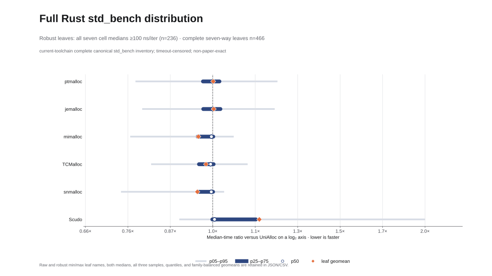
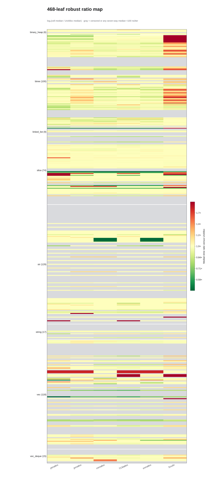

# Full Rust `std_bench` allocator-feature matrix

## Result

The campaign covered all 468 canonical `std_bench` leaves under all seven
allocator feature variants. Of the 3,276 allocator/benchmark cells, 3,268
completed with one discarded warm-up process and three measured fresh
processes. Eight warm-up cells reached the 30-second timeout. This leaves 466
benchmarks with complete seven-allocator comparisons.

Every ratio below is `variant median / UniAlloc median`; lower values mean less
time on that benchmark. The headline set contains the 236 comparable
benchmarks whose median is at least 100 ns/iter under every allocator. This
threshold removes timer-floor leaves while retaining every family. The leaf
geometric mean weights each benchmark equally. The family-balanced geometric
mean first aggregates within each of the eight benchmark families and then
weights those families equally.



| Variant | Cargo feature | Robust leaves | Leaf geomean | Family-balanced geomean | p05 | p50 | p95 |
|---|---|---:|---:|---:|---:|---:|---:|
| UniAlloc | `bench_ourself` | 236 | 1.000000 | 1.000000 | 1.000000 | 1.000000 | 1.000000 |
| ptmalloc | `bench_ptmalloc` | 236 | 0.979548 | 0.940194 | 0.759959 | 0.999538 | 1.160767 |
| jemalloc | `bench_jemalloc` | 236 | 0.977940 | 0.931322 | 0.689210 | 0.999273 | 1.198204 |
| mimalloc | `bench_mimalloc` | 236 | 0.930230 | 0.888548 | 0.555154 | 0.992725 | 1.119873 |
| TCMalloc | `bench_tcmalloc` | 236 | 0.956720 | 0.909861 | 0.719811 | 0.998255 | 1.126242 |
| snmalloc | `bench_snmalloc` | 236 | 0.929647 | 0.872489 | 0.645329 | 0.991640 | 1.118311 |
| Scudo | `bench_scudo` | 236 | 1.134420 | 1.064505 | 0.819154 | 1.007774 | 1.831768 |

The robust medians cluster close to parity: p50 ranges from 0.991640 for
snmalloc to 1.007774 for Scudo. The tails are much wider. The heatmap retains
the benchmark identity behind each ratio.



## Named robust extrema

The table reports the lowest and highest ratio for each comparison allocator
within the 236-leaf robust set. Medians are the exact values recorded in the
result JSON; ratios are displayed to six decimal places.

| Variant | Edge | Benchmark | Ratio vs. UniAlloc | Variant median (ns/iter) | UniAlloc median (ns/iter) |
|---|---|---|---:|---:|---:|
| ptmalloc | lowest | `vec::bench_flat_map_collect` | 0.135348 | 121,830.91 | 900,131.00 |
| ptmalloc | highest | `slice::sort_large_ascending` | 3.402993 | 14,599.25 | 4,290.12 |
| jemalloc | lowest | `vec::bench_flat_map_collect` | 0.135836 | 122,269.77 | 900,131.00 |
| jemalloc | highest | `str::trim_ascii_char::long_lorem_ipsum` | 1.991424 | 1,356.16 | 681.00 |
| mimalloc | lowest | `vec::bench_flat_map_collect` | 0.137383 | 123,662.75 | 900,131.00 |
| mimalloc | highest | `vec::bench_retain_100000` | 1.795649 | 59,617.91 | 33,201.31 |
| TCMalloc | lowest | `vec::bench_flat_map_collect` | 0.137315 | 123,601.71 | 900,131.00 |
| TCMalloc | highest | `vec::bench_dedup_none_1000` | 1.978048 | 535.24 | 270.59 |
| snmalloc | lowest | `vec::bench_flat_map_collect` | 0.136572 | 122,932.51 | 900,131.00 |
| snmalloc | highest | `btree::map::iter_10k` | 1.440570 | 13,333,350.20 | 9,255,606.05 |
| Scudo | lowest | `str::trim_start_ascii_char::long_lorem_ipsum` | 0.502950 | 682.84 | 1,357.67 |
| Scudo | highest | `btree::map::clone_fat_val_100_and_clear` | 18.213971 | 103,993.94 | 5,709.57 |

UniAlloc is the reference, so its ratio is 1.0 for every selected leaf. The
extrema are descriptive observations from this campaign. Three measured
processes support medians and ranges. Confidence intervals require a larger
sample set.

## Largest remaining UniAlloc gap

`vec::bench_flat_map_collect` is the stable low-ratio extreme for ptmalloc,
jemalloc, mimalloc, TCMalloc, and snmalloc. Its timed closure collects 500,000
four-byte arrays into a new 2,000,000-byte `Vec<u8>` on every iteration. That
request is about 489 pages on this host. UniAlloc's single hosted warm-run slot
currently accepts runs only through 512 KiB/128 pages, so this allocation is
released through the cold hosted path. The exact-size reuse slot covers the
bounded range through 128 pages.

A representative second measured process recorded 900,131.00 ns/iter, 148,060
minor faults, and 0.22 seconds of system time for UniAlloc. The five faster
comparison allocators recorded 121,830.91--123,662.75 ns/iter, 1,314--6,278
minor faults, and 0--0.01 seconds of system time. Scudo followed the same cold
pattern at 900,662.80 ns/iter, 148,131 minor faults, and 0.23 seconds of system
time. The three timing samples for every allocator remain tightly clustered.

A focused syscall profile over 302 reported iterations counted 305 UniAlloc
2 MiB `mmap` calls, 302 `munmap(2,002,944)`, and 301
`munmap(94,208)` bump-tail releases. The matching ptmalloc profile issued 19
`mmap` and four `munmap` calls in total. The command metadata, syscall-size
aggregate, compact `strace -c` summaries, stdout, and hashes are preserved in
the ignored raw `focused-flat-map-diagnosis/` directory.

The source cap and process counters identify repeated large-run release,
mapping, and page faults as the remaining policy cliff. A follow-up change can
raise the bounded one-slot ceiling or introduce a size-aware large-run policy,
then rerun this leaf plus RSS controls before refreshing the complete matrix.

## Raw-extrema sensitivity

The raw set keeps all 466 comparable leaves, including positive medians below
100 ns/iter. These extrema show the sensitivity introduced by timer-floor
measurements.

| Variant | Edge | Benchmark | Ratio vs. UniAlloc | Variant median (ns/iter) | UniAlloc median (ns/iter) |
|---|---|---|---:|---:|---:|
| ptmalloc | lowest | `binary_heap::bench_peek_mut_deref_mut` | 0.000008149 | 0.27 | 33,132.26 |
| ptmalloc | highest | `slice::sort_large_ascending` | 3.402993 | 14,599.25 | 4,290.12 |
| jemalloc | lowest | `vec::bench_flat_map_collect` | 0.135836 | 122,269.77 | 900,131.00 |
| jemalloc | highest | `str::trim_ascii_char::long_lorem_ipsum` | 1.991424 | 1,356.16 | 681.00 |
| mimalloc | lowest | `vec::bench_flat_map_collect` | 0.137383 | 123,662.75 | 900,131.00 |
| mimalloc | highest | `str::trim_end_ascii_char::short_mixed` | 1.935743 | 24.10 | 12.45 |
| TCMalloc | lowest | `vec::bench_flat_map_collect` | 0.137315 | 123,601.71 | 900,131.00 |
| TCMalloc | highest | `vec::bench_dedup_none_1000` | 1.978048 | 535.24 | 270.59 |
| snmalloc | lowest | `vec::bench_flat_map_collect` | 0.136572 | 122,932.51 | 900,131.00 |
| snmalloc | highest | `str::trim_end_ascii_char::short_mixed` | 1.936546 | 24.11 | 12.45 |
| Scudo | lowest | `binary_heap::bench_peek_mut_deref_mut` | 0.000007847 | 0.26 | 33,132.26 |
| Scudo | highest | `btree::map::clone_fat_val_100_and_clear` | 18.213971 | 103,993.94 | 5,709.57 |

The robust table is the primary result. The raw table remains available for
auditing the full positive-measurement surface.

## Timeout-censored cells

| Benchmark | Allocator variants | Phase | Timeout | Measured samples retained |
|---|---|---|---:|---:|
| `btree::map::iter_1m` | all seven | warm-up | 30 s | 0 |
| `linked_list::bench_push_back` | Scudo | warm-up | 30 s | 0 |

Each timeout became a terminal censored cell. The runner skipped its three
measured processes and assigned no timing or ratio. Scudo's
`linked_list::bench_push_back` stderr also recorded `Can't populate more pages
for size class 64.` and `Can't populate more pages for size class 96.` The raw
evidence preserves those messages without converting them into a timing
estimate.

## Method

- Inventory: 468 exact benchmark names: 6 `binary_heap`, 100 `btree`, 9
  `linked_list`, 74 `slice`, 129 `str`, 17 `string`, 118 `vec`, and 15
  `vec_deque` leaves. Every allocator binary exposed the same byte-identical
  list.
- Matrix: seven separate Cargo builds, each with exactly one `bench_*`
  allocator selector. The repository's default `pthread_dtor` and `rseq`
  features remained enabled.
- Processes: one discarded warm-up plus three measured fresh processes per
  complete cell. Each process ran one exact leaf with one libtest thread. Build
  time was excluded.
- Placement: four deterministic lanes on CPUs 0, 4, 8, and 12, all bound to
  NUMA node 0. The canonical benchmark index modulo four selected the lane.
- Statistic: each cell is the median of exactly three measured `ns/iter`
  values. Cross-allocator ratios require all seven cells to be complete and
  positive.
- Distribution: leaf ratios use UniAlloc as the reference. Quantiles use linear
  interpolation at `(n - 1) * p`. Extrema ties use benchmark lexical order.
  Family-balanced results are the geometric mean of the eight family
  geometric means.
- Robustness: the headline set requires every allocator median for the leaf to
  be at least 100 ns/iter. The raw set applies no timer-floor threshold.

The execution produced 13,080 terminal records: 3,276 warm-ups and 9,804
measured processes. The planned maximum was 13,104; eight censored warm-ups
removed 24 measured processes. The final state is
`complete_with_timeout_censoring`.

## Provenance and host diagnostics

- Source worktree: clean detached commit
  `071c4f06426ea06a66419e4ffd208a3cb7c2bb7f`; measured `unialloc` source-tree
  hash `a96b4143548598a65dfd9d85e3ed6e04f8922875`.
- Toolchain: `rustc 1.98.0-nightly (485ec3fbc 2026-06-10)`, repository pin
  `nightly-2026-06-11`; LLVM 22.1.6.
- Host: dual-socket AMD EPYC 9354, Linux 6.8.0-111-generic. The selected CPUs
  are separate physical cores on NUMA node 0.
- Measurement interval: 2026-07-14 23:37:17.691791 UTC through 2026-07-15
  00:58:23.942008 UTC.
- Shared-host diagnostics across all process starts: one-minute load 3.23 to
  25.62, median 9.21. Across measured-process boundaries, recorded CPU
  frequency ranged from 1.386842 to 3.971448 GHz, with a 3.794420 GHz median.
  Measured-process involuntary context switches had median 3, p95 23, and
  maximum 1,095. The maximum recorded process RSS was 11,864,064 KiB.
- Runtime environment: `GLIBC_TUNABLES` absent; glibc's default rseq policy
  retained.
- TCMalloc runtime SHA256:
  `3e9994675a51a1a7f893e02236b36e3150a37b5e8ea740e0cc78f6650f7b1841`.
- Scudo runtime: packaged LLVM 18 standalone allocator at
  `/usr/lib/llvm-18/lib/clang/18/lib/linux/libclang_rt.scudo_standalone-x86_64.so`,
  SHA256
  `e7859566ba641ac49674e5c51c6edf605624786a4a4a748b31b73ec0135c9d6f`.
  Its dpkg content check and behavioral probe passed, and every Scudo process
  emitted exactly one runtime-identity marker.

The shared-host load and the three-sample cell size keep this result at
diagnostic grade. This is a current-toolchain full-`std_bench` comparison. Many
timed closures exercise library operations without allocating, so the matrix
measures whole benchmark closures under allocator-linked binaries. The
[allocator-focused eight-leaf panel](std-bench-allocator-variants-evaluation.md)
provides the narrower allocation-heavy view.

## Artifacts

- Machine-readable result:
  [`benchmark-results/std-bench-allocator-full-20260714.json`](../benchmark-results/std-bench-allocator-full-20260714.json)
- Long-form cell and sample data:
  [`std-bench-allocator-full-all-cells.csv`](figures/std-bench-allocator-full-20260714/std-bench-allocator-full-all-cells.csv)
- Ratio distribution:
  [`SVG`](figures/std-bench-allocator-full-20260714/allocator-ratio-distribution.svg),
  [`PNG`](figures/std-bench-allocator-full-20260714/allocator-ratio-distribution.png)
- Per-leaf heatmap:
  [`SVG`](figures/std-bench-allocator-full-20260714/allocator-ratio-heatmap.svg),
  [`PNG`](figures/std-bench-allocator-full-20260714/allocator-ratio-heatmap.png)
- Artifact hashes:
  [`artifact-manifest.json`](figures/std-bench-allocator-full-20260714/artifact-manifest.json)
- Ignored raw evidence:
  `evaluation/raw/std-bench-allocator-full-20260714/` contains build logs,
  dependency-feature closures, binary identities, authenticated runtime
  provenance, benchmark inventories, per-process stdout/stderr/GNU-time
  records, cell summaries, censored-cell records, and `records.jsonl`.
  Its `focused-flat-map-diagnosis/` subdirectory preserves the bounded syscall
  evidence for the largest remaining UniAlloc gap.

The raw summary SHA256 is
`9b224be377e1719031bdd907ee26fbed71b916fef6cc6b00b3f0fcde0d96cca9`;
the raw records SHA256 is
`e5499bca4d7ebbf722ceeeff881bf905e7e2a2879f2c921fc481f3380a4e286f`.

## Reproduce

Run from a clean detached worktree. Set the TCMalloc library directory to the
directory containing the authenticated `libtcmalloc.so.4` used for the
campaign.

```bash
RAW_ROOT="$PWD/evaluation/raw/std-bench-allocator-full-20260714"
git worktree add --detach /tmp/unialloc-full-std-bench-run \
  071c4f06426ea06a66419e4ffd208a3cb7c2bb7f
cd /tmp/unialloc-full-std-bench-run

numactl --physcpubind=0-15 --membind=0 taskset -c 0-15 \
  uv run python evaluation/scripts/run_std_bench_allocator_full.py \
  --source-root "$PWD" \
  --output-dir "$RAW_ROOT" \
  --jobs 4 --cpus 0,4,8,12 --numa-node 0 \
  --timeout-seconds 30 \
  --tcmalloc-lib-dir "$UNIALLOC_TCMALLOC_LIB_DIR" \
  --scudo-runtime-library \
    /usr/lib/llvm-18/lib/clang/18/lib/linux/libclang_rt.scudo_standalone-x86_64.so

uv run evaluation/scripts/plot_std_bench_allocator_full.py \
  --summary "$RAW_ROOT/summary.json" \
  --records "$RAW_ROOT/records.jsonl"
```

The runner binds resume state to the source commit, inventory, binaries,
runtime hashes, CPU/NUMA placement, timeout, and measurement shape. It fails
closed on identity drift, malformed records, invalid exact-benchmark output,
or allocator-runtime authentication failure.
