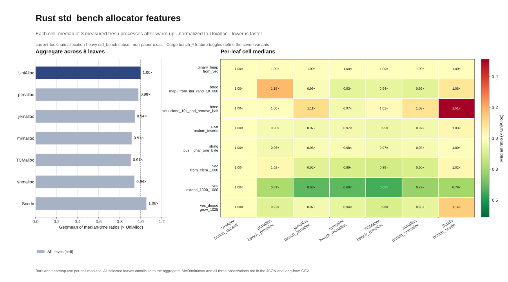

# Rust `std_bench` allocator-feature variants

## Result

The seven Cargo allocator selectors were measured as seven separate variants.
Each benchmark cell is the median of three measured fresh processes after one
discarded warm-up. Lower ratios mean less time than UniAlloc on the same
benchmark.



| Variant | Cargo feature | Geometric mean of per-leaf median ratios vs. UniAlloc | Observed time difference |
|---|---|---:|---:|
| UniAlloc | `bench_ourself` | 1.000 | baseline |
| ptmalloc | `bench_ptmalloc` | 0.979 | -2.1% |
| jemalloc | `bench_jemalloc` | 0.944 | -5.6% |
| mimalloc | `bench_mimalloc` | 0.914 | -8.6% |
| TCMalloc | `bench_tcmalloc` | 0.906 | -9.4% |
| snmalloc | `bench_snmalloc` | 0.941 | -5.9% |
| Scudo | `bench_scudo` | 1.055 | +5.5% |

The aggregate is a geometric mean of eight per-benchmark ratios. Raw
nanoseconds from different benchmark leaves are never averaged together.
`binary_heap::bench_from_vec` now clusters tightly: UniAlloc's median was
109.5 us/iter, while all seven variants measured 109.1--110.0 us/iter. Scudo
measured 1.51x UniAlloc on
`btree::set::clone_10k_and_remove_half` and 1.14x on
`vec_deque::bench_grow_1025`. The clearest remaining UniAlloc gap is
`vec::bench_extend_1000_1000`, where the other allocators measured
0.65--0.81x UniAlloc.

These results are current-toolchain diagnostics. The three retained samples
support medians, MAD, and min/max ranges. They do not support confidence
intervals or paper-reproduction claims. UniAlloc's three optimized
`binary_heap::bench_from_vec` observations were 109.3, 109.5, and 109.6
us/iter. A separate five-process focused rerun of the committed binary produced
a 112.3 us/iter median and 2.6 us/iter MAD. The shared host's one-minute load
varied from 8.41 to 14.71 during the full campaign.

## Root cause and optimization

The preceding campaign exposed a single 400,000-byte policy cliff. Each
`binary_heap::bench_from_vec` iteration clones 100,000 `u32` values, producing
a 98-page allocation on this 4 KiB-page host. UniAlloc's default hosted
intrusive free list retained ordinary runs through 256 KiB/64 pages, so every
98-page free returned the mapping to the OS. The next iteration allocated a
new 512 KiB bump window and released its unused tail.

Direct profiling attributed the old 414.4 us/iter median to that mapping churn:
the benchmark process issued 9,359 `mmap` calls, 18,608 `munmap` calls, and
911,985 minor faults. Reused-buffer copy and heapify controls ran at the same
speed under UniAlloc and `System`.

Commit `dccf085fd11d22341b262591b64643ab5e73bbef` adds one markerless,
alignment-aware warm large-run slot to the default hosted intrusive backend.
It covers exact runs above the 256 KiB list cap through 512 KiB, replaces the
slot with the most recently freed eligible run, and unmaps an evicted run only
after releasing allocator locks. The existing multi-run retention cap remains
256 KiB; the new steady-state mapped-memory allowance is bounded to one
512 KiB run per `FreeList`.

The focused five-process validation measured 112.3 us/iter, 565 median minor
faults, 59 `mmap` calls, and 7 `munmap` calls per process including startup.
That is a 3.69x speedup for the affected leaf and places its full-campaign
median within 0.5% of every allocator variant.

## Matrix

- Source: clean detached `dev` commit
  `dccf085fd11d22341b262591b64643ab5e73bbef`.
- Toolchain: `rustc 1.98.0-nightly (485ec3fbc 2026-06-10)` from the repository's
  `nightly-2026-06-11` pin.
- Benchmark inventory: the same byte-identical 468-name `std_bench` list for
  every variant.
- Selected allocation-heavy leaves:
  - `binary_heap::bench_from_vec`
  - `btree::map::from_iter_rand_10_000`
  - `btree::set::clone_10k_and_remove_half`
  - `slice::random_inserts`
  - `string::bench_push_char_one_byte`
  - `vec::bench_from_elem_1000`
  - `vec::bench_extend_1000_1000`
  - `vec_deque::bench_grow_1025`
- Schedule: 56 discarded warm-up processes plus 168 measured processes, for
  224/224 valid fresh-process executions.
- Placement: CPU 20, NUMA node 0; allocator order rotates by round and leaf.
- Runtime environment: allocator defaults, stats disabled, `GLIBC_TUNABLES`
  absent, and glibc's default rseq policy retained.
- Timing: build time excluded; each process runs one exact leaf through the
  built libtest benchmark binary.

All allocator binaries include the repository's default `pthread_dtor` and
`rseq` features. The variant dimension is the single `bench_*` selector. The
recorded Cargo resolution proves that exactly one allocator selector was active
in each binary.

## Scudo identity

Scudo used the packaged LLVM 18 standalone runtime:

```text
/usr/lib/llvm-18/lib/clang/18/lib/linux/libclang_rt.scudo_standalone-x86_64.so
SHA256 e7859566ba641ac49674e5c51c6edf605624786a4a4a748b31b73ec0135c9d6f
package libclang-rt-18-dev:amd64 1:18.1.3-1ubuntu1
```

The runtime passed the repository's dpkg-content and behavioral Scudo probe.
All 32 Scudo warm-up/measured processes emitted exactly one
`unialloc: verified Scudo runtime identity` marker; the inventory process did
the same. The Scudo row therefore measures the authenticated Scudo provider.
The `bench_ptmalloc` row is the explicit `System`/glibc variant.

## Artifacts

- Machine-readable result:
  [`benchmark-results/std-bench-allocator-variants-20260714.json`](../benchmark-results/std-bench-allocator-variants-20260714.json)
- Long-form three-sample data:
  [`std-bench-allocator-variants.csv`](figures/std-bench-allocator-variants-20260714/std-bench-allocator-variants.csv)
- Figures:
  [`SVG`](figures/std-bench-allocator-variants-20260714/allocator-variant-microbench.svg),
  [`PNG`](figures/std-bench-allocator-variants-20260714/allocator-variant-microbench.png)
- Artifact hashes:
  [`artifact-manifest.json`](figures/std-bench-allocator-variants-20260714/artifact-manifest.json)
- Ignored raw evidence:
  `evaluation/raw/std-bench-allocator-variants-20260714/` contains build logs,
  binary hashes, dependency-feature closures, benchmark inventories, per-run
  stdout/stderr/GNU-time records, provenance, and the complete `records.jsonl`.
  Its `focused-large-run-fix/` subdirectory contains the committed-binary
  five-process sample set, minor-fault counts, and syscall summary.

## Reproduce

Run the campaign from a clean detached worktree so unrelated developer changes
cannot enter the build:

```bash
git worktree add --detach /tmp/unialloc-std-bench-variants dccf085fd11d

uv run python evaluation/scripts/run_std_bench_allocator_variants.py \
  --source-root /tmp/unialloc-std-bench-variants \
  --output-dir "$PWD/evaluation/raw/std-bench-allocator-variants-20260714" \
  --measured-rounds 3 \
  --cpu 20 --numa-node 0 \
  --tcmalloc-lib-dir "$UNIALLOC_TCMALLOC_LIB_DIR" \
  --scudo-runtime-library \
    /usr/lib/llvm-18/lib/clang/18/lib/linux/libclang_rt.scudo_standalone-x86_64.so

uv run evaluation/scripts/plot_std_bench_allocator_variants.py
```

The runner fails closed on a dirty source worktree, missing benchmark leaf,
different benchmark inventory, duplicate allocator selector, invalid timing
record, unpinned TCMalloc runtime, unauthenticated Scudo artifact, or absent
Scudo identity marker.
